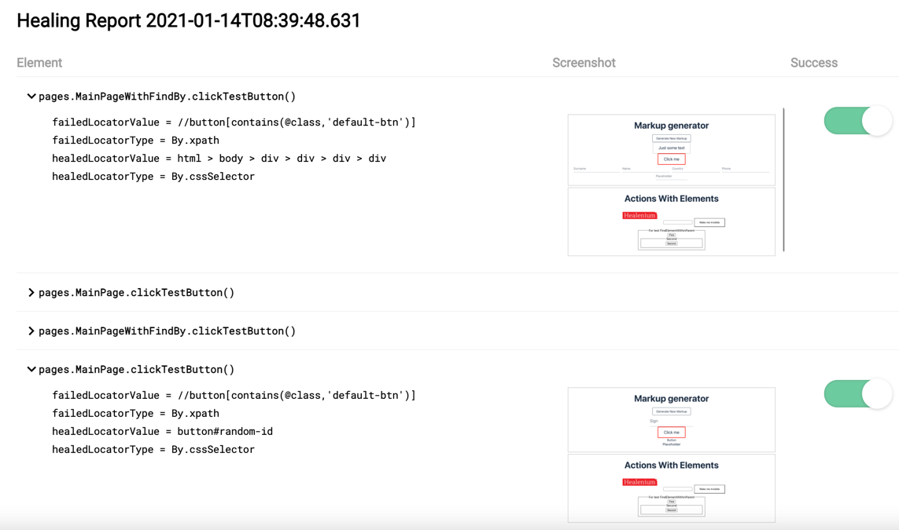

# healenium-example-maven
Java + Maven + Junit5 project with healenium usage example 

## How to start
### 1.Start Healenium backend from infra folder

```cd infra```

```docker-compose up -d```

Verify that images ```healenium/hlm-backend:latest``` and ```postgres:11-alpine``` are up and running

### 2. Project structure
```
|__pom.xml
   |__healenium-web-htmlelements
        |__src
            |__main
                |__java
                    |__htmlelements.pages	
            |__test
                |__java
                    |__htmlelements.tests
                |__resources
                    |__healenium.properties			
   |__healenium-web-selenide
        |__src
            |__main
                |__java
                    |__selenide.pages
            |__test
                |__java
                    |__selenide.tests	
                |__resources
                    |__healenium.properties			
   |__healenium-web-selenium
        |__src
            |__main
                |__java
                    |__selenium.pages
            |__test
                |__java
                    |__selenium.tests	
                |__resources
                    |__healenium.properties	
``` 
			   
### 3.Run test in terminal with maven
> If you want to execute all tests, please use the command: 
```mvn clean test```

> If you want to execute tests from healenium-web-htmlelements module, please use the command: 
```mvn clean test -Dtest=HtmlElementTests -pl healenium-web-htmlelements/```

> If you want to execute tests from healenium-web-selenide module, please use the command: 
```mvn clean test -Dtest=SelenideTests -pl healenium-web-selenide/```
>> Also if you want to get an allure report you could use this command:
```mvn clean test -Dtest=SelenideTests -pl healenium-web-selenide/ allure:report```

> If you want to execute tests from healenium-web-selenium module, please use the command: 
```mvn clean test -Dtest=MarkupTest -pl healenium-web-selenium/```
>> Also if you want to get an allure report you could use this command:
```mvn clean test -Dtest=MarkupTest -pl healenium-web-selenium/ allure:report```

>  If you want to get a Report Portal report you could use this command:
```mvn clean test -Dtest=MarkupTest -pl healenium-web-selenium-rp/```
>>Do not forget to specify your rp.uuid and rp.project values in reportportal.properties file under test/resources

>  If you want to run test on Selenoid you could use this command:
```mvn clean test -Dtest=MarkupTest -pl healenium-web-selenoid/```
>>Do not forget to change Selenoid URl in BaseTest: URI.create("your-selenoid-url:4444/wd/hub").toURL()
 

### 4.After test execution you should see generated report link in command line logs


Report contains only healed locators with old-new values and a button that tells if healing was successful for further algorithm corrections



### 5. Screenshots 

Also you could take a screenshots for your tests like it implements here: selenium.tests.BaseTest.screenshot
```
  public byte[] screenshot() {
      return ((TakesScreenshot) driver.getDelegate()).getScreenshotAs(OutputType.BYTES);
  }
```
### 6. @DisableHealing annotation

If don't want to use Healenium in some methods just use @DisableHealing annotation. 
> The example of usage you can find here: selenium.pages.MainPageWithFindBy.checkLocatorTestButtonDontHealing 


### 7. Plugin Healenium for Intellij IDE

For updating broken locators you could use Plugin "Healenium" for Intellij IDE (https://plugins.jetbrains.com/plugin/14178-healenium).

With this plugin you can update your locators:
* on class level


* or on variable level


